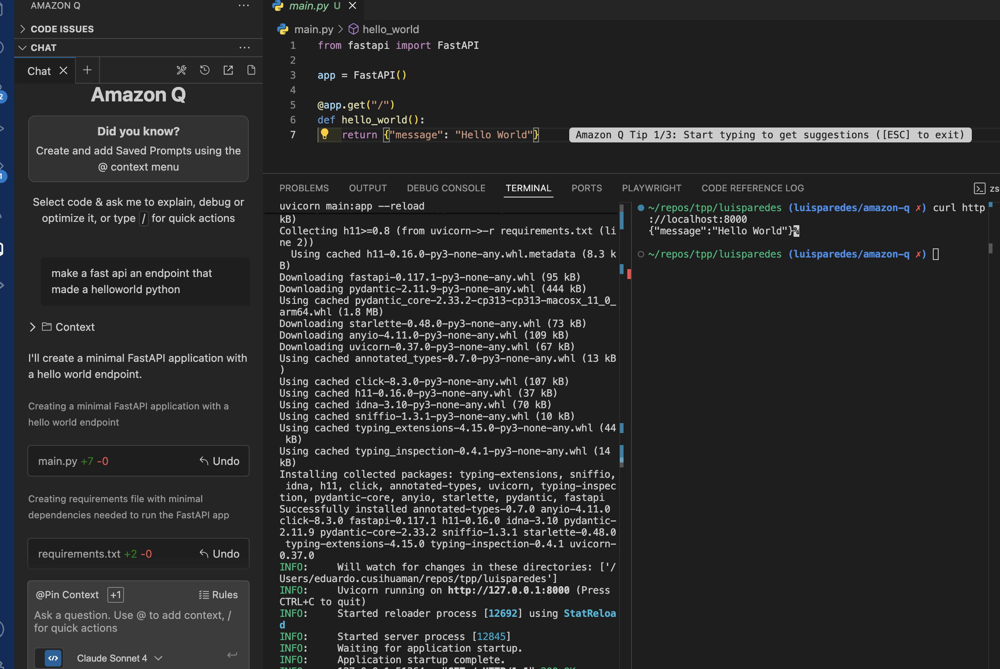

# 🚀 FastAPI Hello World with Amazon Q AI



## 🌟 What is Amazon Q?

Amazon Q is AWS's revolutionary AI-powered assistant that transforms how developers build, deploy, and manage applications! 🤖✨

### 🎯 What Amazon Q Does:
- **💡 Intelligent Code Generation**: Creates high-quality code snippets and complete applications
- **🔍 Smart Code Analysis**: Reviews your code for bugs, security issues, and optimization opportunities
- **📚 AWS Expert Knowledge**: Provides instant guidance on AWS services and best practices
- **🛠️ Development Acceleration**: Speeds up development with AI-powered suggestions
- **🔒 Security First**: Helps identify and fix security vulnerabilities in real-time
- **📖 Documentation Helper**: Generates comprehensive documentation and explanations

## 🏗️ This Project

A minimal FastAPI application showcasing the power of AI-assisted development with Amazon Q!

### 📁 Project Structure
```
├── main.py           # 🐍 FastAPI application
├── requirements.txt  # 📦 Dependencies
└── README.md        # 📖 This file
```

### 🚀 Quick Start

1. **Install dependencies**:
   ```bash
   pip install -r requirements.txt
   ```

2. **Run the application**:
   ```bash
   uvicorn main:app --reload
   ```

3. **Visit**: `http://localhost:8000/` 🌐

### 📋 API Endpoints

| Method | Endpoint | Description |
|--------|----------|-------------|
| GET    | `/`      | 👋 Hello World message |

### 🎉 Response Example
```json
{
  "message": "Hello World"
}
```

---

*Built with ❤️ using Amazon Q AI assistance*

